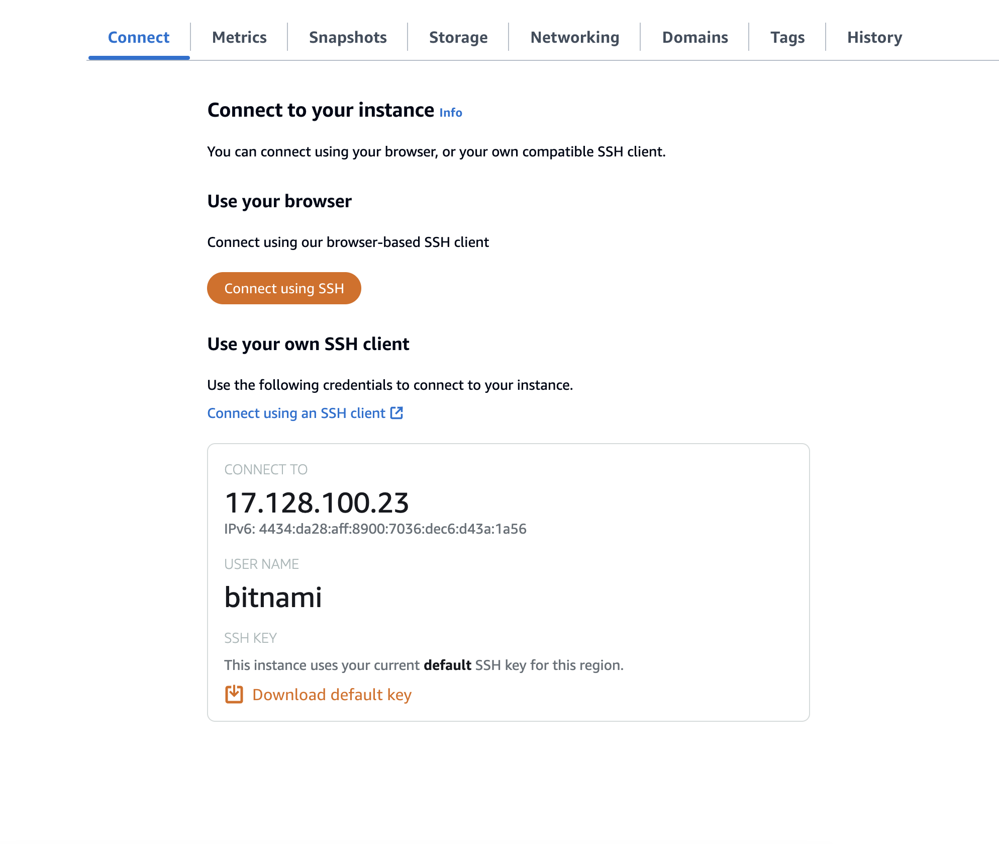

## Install ansible

On Macos, it's simple to install ansible by using `brew`

```
$ brew install ansible
```

## Connect ansible host to aws lightsail node
Click on aws lightsail instance and go to Connect tab, you can see the following information



There are 3 information we need to get here:
1. The ssh key => click on `Download default key` link to download the key
2. The ip address
3. The username

Save the 3 above to a save place

## Add ssh key

Next, open your terminal to add ssh key as follow

```
$ sudo chmod 600 ./LightsailDefaultKey-ap-southeast-1.pem
$ ssh-add ./LightsailDefaultKey-ap-southeast-1.pem
```

## Ping to nodes and try to install some packages

Create a file called `invenroty.yml` first

```
$ ansible webservers -m ping -i inventory.yml
```

If everything works, you can start using ansible to do your things

```
$ ansible-playbook -i inventory.yml ./ubuntu/01-install-webserver.yml
```

> Keep in mind that, the example run on Ubuntu, if you're using another OS, please use another command: https://docs.ansible.com/ansible/latest/collections/ansible/builtin/yum_repository_module.html#examples

